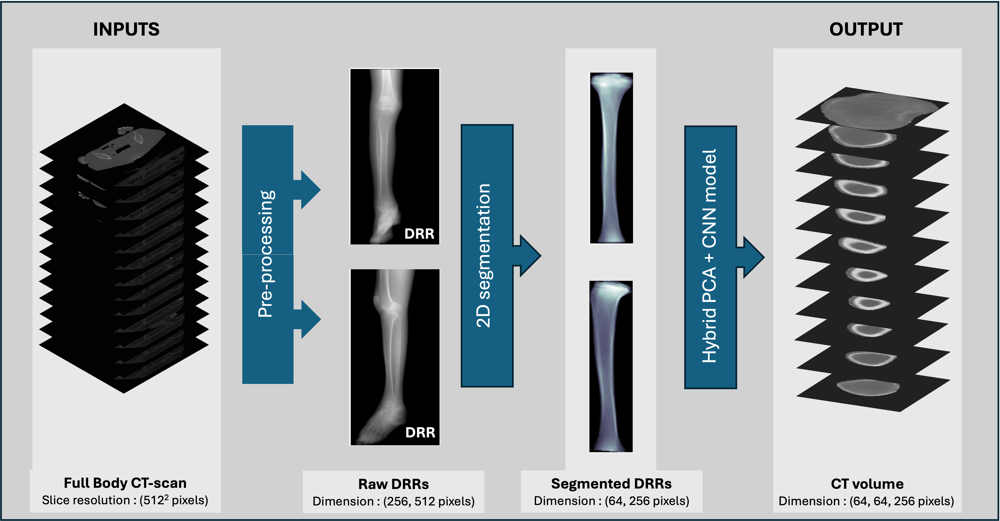

# 🦴 DRR2-HUmap

**DRR2-HUmap** is a modular pipeline to reconstruct 3D tibia CT volumes from two X-ray–like DRRs using PCA modeling and deep learning. It combines segmentation, regression, and volume reconstruction for accurate and interpretable HU predictions from minimal input.

---

## 🚀 Features

- 🔍 Reconstruct full 3D tibia volumes (shape + density) from only two DRRs.
- 🧠 Hybrid architecture: PCA + CNN regression.
- 📏 Physically motivated DRR generation using Beer–Lambert law.
- 📦 Clean, modular Python codebase with training + evaluation scripts.
- 📊 Metrics include Dice, MAE, SSIM, Cosine Similarity, and more.
- 📚 Ready for research and publication with notebooks and documentation.

---


## 🧱 Project Structure
DRR2-HUmap/
├── src/ # Main package (segmentation, regression, utils)
├── scripts/ # Main training/inference pipeline scripts
├── examples/ # Sample config files
├── notebooks/ # Jupyter examples and evaluations
├── docs/ # Method explanations and design notes
├── tests/ # Basic unit test framework
├── requirements.txt # Python dependencies
├── GETTING_STARTED.md # How to install and run
├── README.md # Project overview (this file)
└── LICENSE # License file


---

## ⚙️ Installation

```bash
# Clone the repository
git clone https://github.com/yourusername/DRR2-HUmap.git
cd DRR2-HUmap

# (Optional) Create a virtual environment
python -m venv venv
source venv/bin/activate  # or venv\Scripts\activate on Windows

# Install dependencies
pip install -r requirements.txt

# Install as editable package
pip install -e .

🧪 Usage

🔄 Full Pipeline (DRRs → 3D Volume)
python scripts/run_full_pipeline.py --config examples/config.yaml
🧠 Train Regression Model
python scripts/train_predictor.py --config examples/train_config.yaml
📈 Evaluate Model
python scripts/evaluate_pipeline.py --config examples/eval_config.yaml
Preprocessing scripts and DRR generators are included in src/drr2humap/preprocessing/ and src/drr2humap/drr/.

📊 Metrics

Dice Score – Shape overlap accuracy
Mean Absolute Error (MAE) – Intensity difference
SSIM – Structural similarity of 3D reconstructions
Cosine Similarity – PCA vector comparison
Voxelwise Heatmaps – Visual reconstruction accuracy
📂 Sample Data

Due to size restrictions, sample input/output is not included. You may add synthetic .npy files in a sample_data/ directory to test the pipeline.

🧠 Citation

If you use this work in your research, please cite:

[Your Name], DRR2-HUmap: Interpretable Tibia CT Reconstruction from Biplanar DRRs using PCA-Guided Deep Learning, 2025.
DOI or arXiv link (TBD)
BibTeX:

@article{your2025drr2humap,
  title={DRR2-HUmap: Interpretable Tibia CT Reconstruction from Biplanar DRRs using PCA-Guided Deep Learning},
  author={Your Name},
  year={2025},
  journal={arXiv preprint arXiv:XXXX.XXXXX}
}
📄 License

This project is licensed under the MIT License. See the LICENSE file for details.

✨ Acknowledgements

This work was supported as part of an MSc research project on interpretable deep learning for medical imaging. Special thanks to the open-source contributors and dataset providers.


Let me know if you’d like:
- A pipeline diagram (`.png` or `.svg`) to include in the README,
- A condensed version of `GETTING_STARTED.md`,
- Or help uploading this to your GitHub with proper tags and releases.
